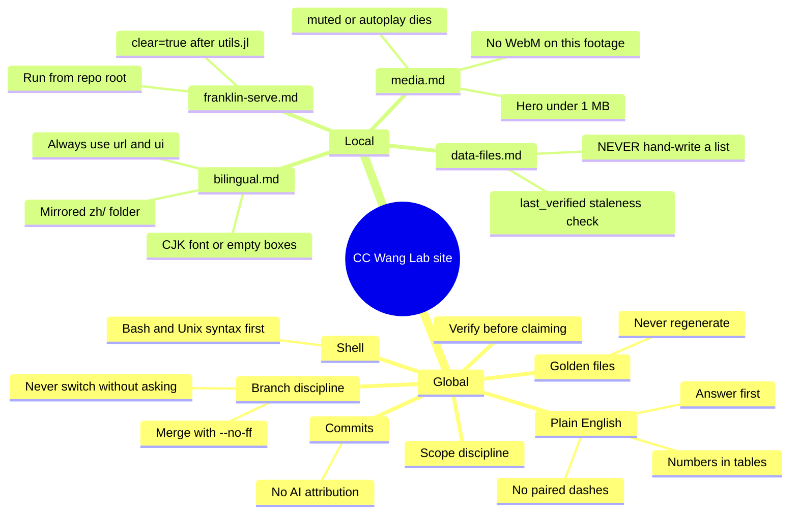
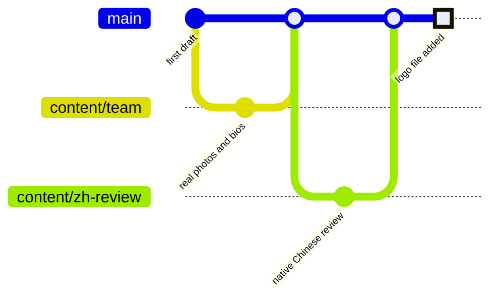
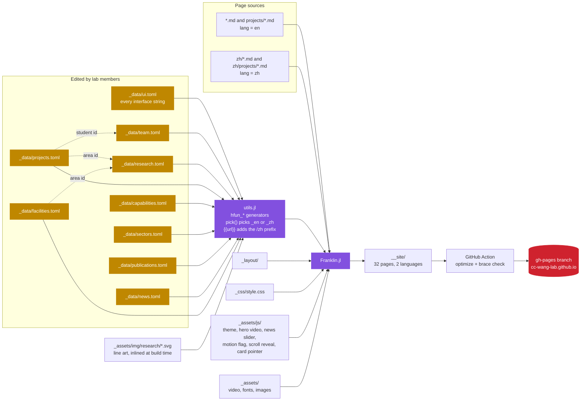
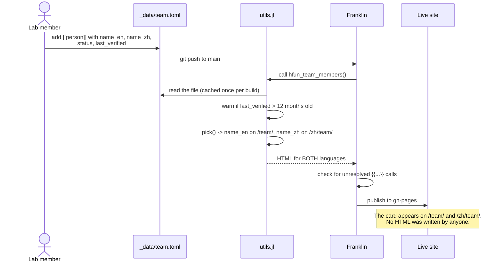
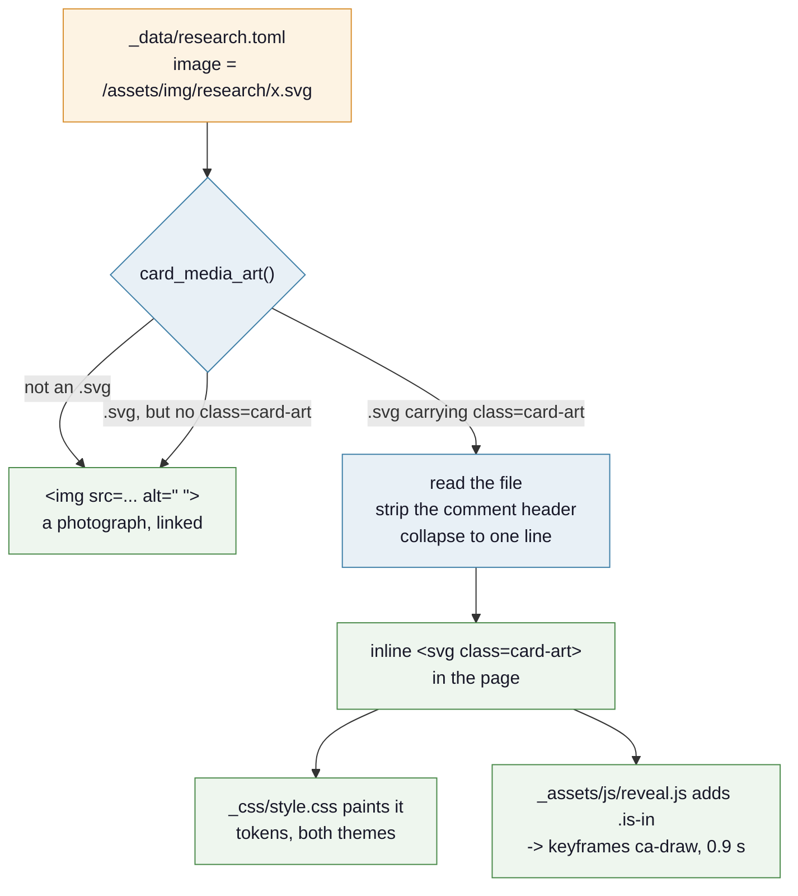
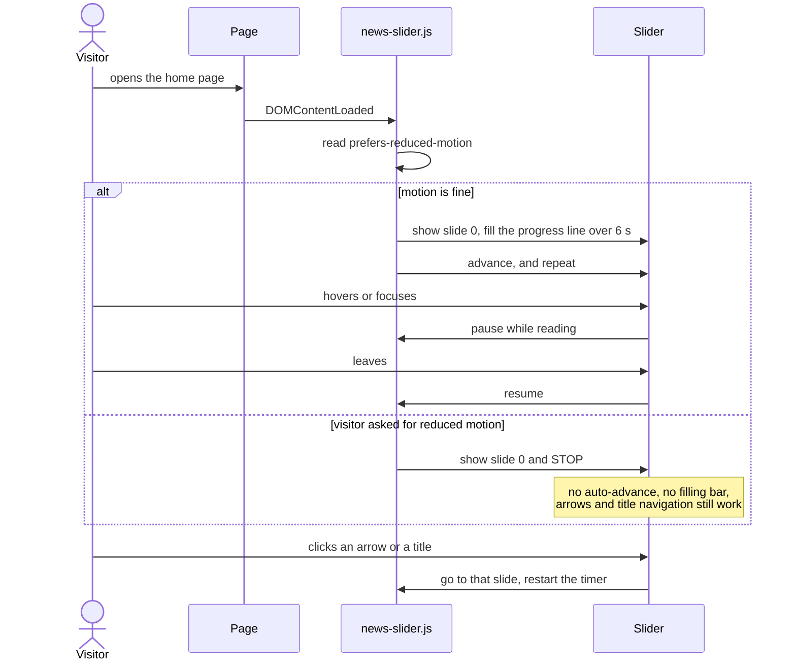

# Architecture

Four diagrams. Update them in the **same commit** as the change that makes one stale.

## Rules

Every rule that governs this repository. Blue is global, green is local, red is the one that must
never be broken.

## Branching

`main` is the only long-lived branch. The Action publishes to `gh-pages`, which is generated and
never edited by hand.

## How a page is built

Data goes in on the left, HTML comes out on the right. **No list on this site is written by hand.**
The dashed arrows are the cross-references: a project names its researcher and its research area by
id, so neither is ever typed twice.

## Adding a person to the site

The whole point of the design: one row of TOML, and both language sites update.

## How a research card gets its picture

Two pictures on the home page are photographs and four are line drawings of the physics. The card
markup is the same for both, so the choice happens once, at build time, in `card_media_art()`.

A drawing is **inlined into the page** rather than linked. That is the whole reason it can draw
itself: an SVG behind `` is a closed document that neither the stylesheet nor any
script can reach into.

**Nothing is ever hidden.** A path with no dash is a whole path, and the dash exists only for the
0.9 s the animation runs. If `reveal.js` never runs, `.is-in` never lands and every drawing is
simply complete. That is a structural guarantee rather than a guard, and it is there because a
card that fades in and then fails to arrive is the worst bug this site can ship. The measurements
behind it are in `.claude/rules/animation.md`.

## What the news slider does, and for whom

The one piece of behaviour on this site that changes by visitor. It exists because a slider that
moves on its own is exactly what a reduced-motion preference is meant to stop.

